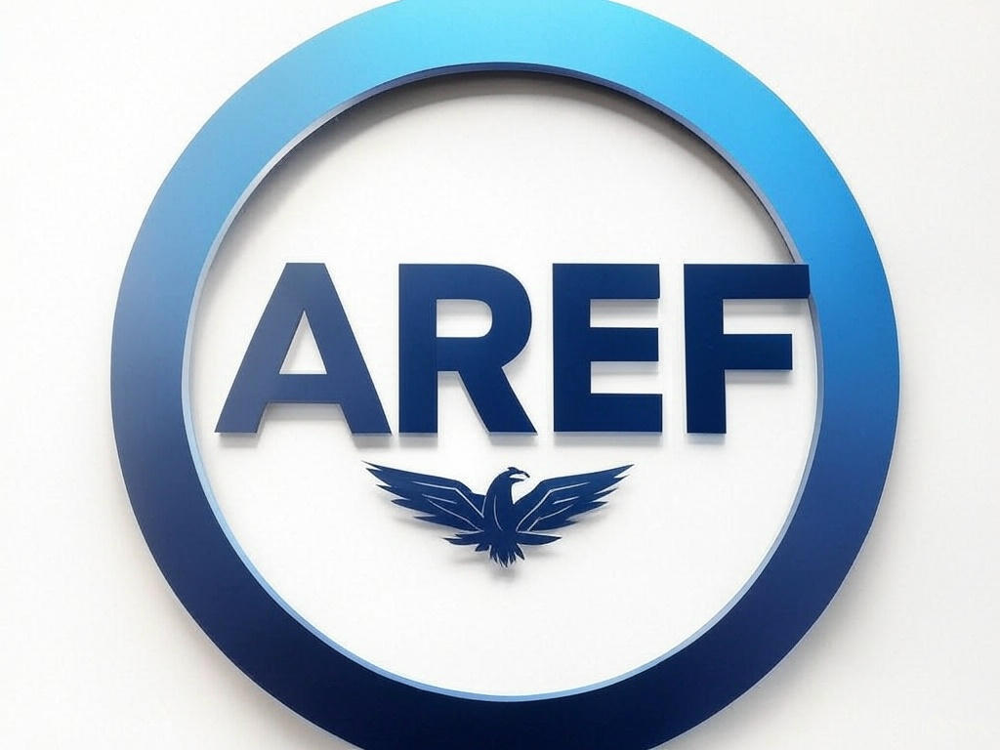

# AREF-Toolkit (Prometheus)

Author: Encrypter15  
Email: encrypter15@gmail.com  
Version: 1.12  
Codename: Prometheus  

## Overview
AREF-Toolkit "Prometheus" implements the Adaptive Reconnaissance and Exploitation Framework (AREF). It’s a Python-based, modular powerhouse for dynamic recon and exploitation, built for pros. Version 1.12 brings real-world NVD data to the ML module, igniting actionable insights.

## Features
- **Passive Recon**: OSINT scraping (Shodan, WHOIS), DNS enumeration.
- **Active Recon**: Web crawling, port scanning, service fingerprinting.
- **Cloud Recon**: AWS/GCP/Azure asset discovery.
- **ML Module**: Real-time vuln prediction with BERT, trained on NVD data, CVE/ExploitDB feeds.
- **Reporting**: PTES-style reports (JSON, CSV, HTML, PDF).
- **Parallel Execution**: Multi-threaded recon.
- **Plugin System**: Extensible modules.
- **Config Profiles**: Predefined scopes.

## Changelog
- **1.0 (Odyssey)**: Initial release with passive/active recon and basic reporting.
- **1.1 (Excalibur)**: Parallel execution, cloud recon, plugins, config profiles.
- **1.2 (Pandora)**: Next-gen ML with BERT, live CVE/ExploitDB feeds.
- **1.3 (Morpheus)**: Error handling & logging to `logs/aref.log`.
- **1.4 (Griffin)**: Input validation for `--target` and `credentials.json`.
- **1.5 (Hydra)**: Unit tests in `tests/` with `pytest`.
- **1.6 (Icarus)**: CLI enhancements (`--verbose`, `--quiet`, subcommands).
- **1.7 (Nirvana)**: Pretrained ML model in `data/model.pth`, `train.py` script.
- **1.8 (Titan)**: API caching in `data/cache/`, performance optimization.
- **1.9 (Nature)**: Encrypted `credentials.json` with `cryptography`.
- **1.10 (Quantum)**: Sphinx docs in `docs/`, `CONTRIBUTING.md`.
- **1.11 (Cipher)**: CI/CD with GitHub Actions, Docker support.
- **1.12 (Prometheus)**: Multi-format reports, real NVD data for ML training.

## Setup
1. Clone: `git clone <repo-url>`
2. Install: `pip install -r requirements.txt`
3. Config: Edit `config/profiles.json` and `config/credentials.json` (encrypt with `src/encrypt_creds.py`)
4. Shodan API Key: `export SHODAN_API_KEY=your_key`
5. Passphrase: `export CREDS_PASSPHRASE=your_passphrase`
6. Train ML: `python src/train.py`
7. Run: `python src/main.py --help`

## Directory Structure
- `src/` - Core scripts
- `modules/` - Recon and ML modules
- `reports/` - Output reports
- `config/` - Profiles and encrypted creds
- `plugins/` - Custom extensions
- `data/` - ML model and cache
- `logs/` - Log files
- `tests/` - Unit tests
- `docs/` - Documentation
- `.github/workflows/` - CI/CD

## License
MIT—steal the fire, use it wisely.
